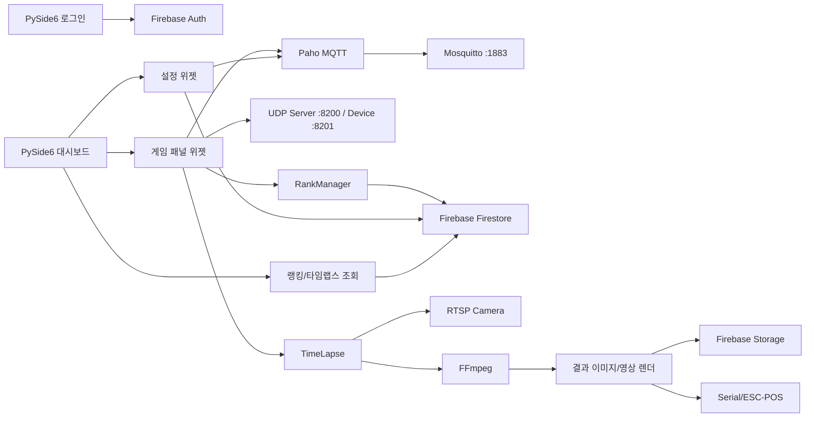
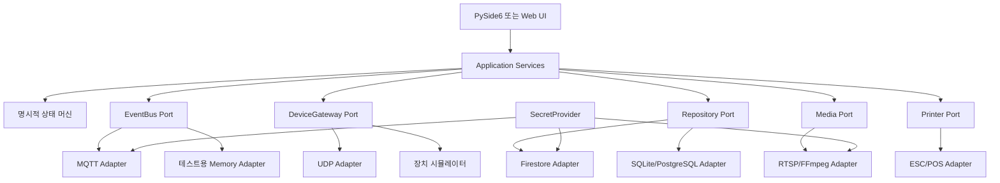

# 점핑배틀 Windows 컨트롤러 전체 정적 분석 보고서

> 분석 대상의 실제 계정·비밀번호·API 키·프로젝트 ID·개인키는 이 문서에 기록하지 않았다.

---

## 종합 분석

## 1. 분석 대상

- 업로드 파일: `프로그램테스트.zip`
- 주 실행 파일: `1_main.exe`
- 실행 파일 형식: PE32+ Windows GUI, x86-64
- 패키징: PyInstaller
- Python 런타임: 3.11
- UI 프레임워크: PySide6/Qt 6
- 내부 프로그램 버전 상수: `v2.0.3`
- PE 링크 타임스탬프: 2025-06-23
- 분석 방식: 압축 해제, 파일·해시 인벤토리, PE 헤더, PyInstaller 아카이브, Python 코드 객체·상수·이름·문자열, 포함된 `.py` 소스의 AST/문법 검사. 실행 및 외부 서버 접속은 하지 않음.

## 2. 복원 가능 범위

| 영역 | 확인 결과 | 커스터마이징 난이도 |
|---|---|---:|
| 화면 레이아웃·버튼·문구 | Qt 생성 코드와 이벤트 연결 소스가 포함됨 | 낮음 |
| 게임 시작·정지·QR·출력 | `widget_game_class.py`에 직접 소스 포함 | 낮음~중간 |
| 패널·맵·표시 순서 설정 | 설정 위젯과 데이터 모델 확인 | 낮음~중간 |
| 점수 수신·장치 제어 | UDP 모듈 바이트코드와 메시지 키 확인 | 중간 |
| 앱/점수 디스플레이 연동 | MQTT 토픽과 클라이언트·브로커 모듈 확인 | 중간 |
| 랭킹·회원·설정 동기화 | Firebase Auth/Firestore/Storage 종속 | 중간~높음 |
| 카메라·타임랩스 | RTSP + FFmpeg, 채널별 작업 모델 확인 | 중간 |
| 영수증/결과 출력 | ESC/POS, serial/USB, 이미지 렌더링 확인 | 중간 |
| 원본 소스 100% 동일 복원 | 일부 핵심이 `.pyc`만 존재하여 주석·서식·일부 의미 정보 손실 | 불가피한 차이 있음 |

### 판정

기능을 원하는 방향으로 바꾸는 것은 가능하다. 다만 원래 개발자의 저장소를 그대로 되살리는 일이 아니라, 다음 두 자산을 조합한 **검증 가능한 재구축**이 현실적인 방법이다.

1. 배포본에 그대로 포함된 UI/업무 `.py` 소스
2. 핵심 `.pyc`에서 확인한 클래스, 함수, 상수, 경로, 프로토콜, 데이터 모델

## 3. 확인된 프로그램 구성

- 1,359개의 Python 바이트코드 파일 추출
- 앱 전용 핵심 모듈 21개 이상 확인
- 배포본에 포함된 `.py` 파일 23개, 총 15,452줄
- 그중 Qt 리소스 생성 코드를 제외한 애플리케이션/화면 코드 약 5천여 줄
- 포함된 `.py` 23개 모두 문법 컴파일 성공
- 주요 라이브러리: PySide6, Firebase Admin, Google Cloud Storage, Paho MQTT, OpenCV, Pillow, qrcode, python-barcode, pyserial, pyusb, python-escpos, psutil, GPUtil, requests, cryptography
- 포함 도구: Mosquitto 브로커, FFmpeg 실행 파일

## 4. 핵심 기능

### 게임 운영

패널마다 게임 상태를 따로 가진다. 시작·정지, 맵, 인원, 팀명, 점수, 남은 시간, 랭킹, 고정 IP, QR 요청 상태가 데이터 모델로 존재한다. 기본 게임 시간은 900초이며, 최대 패널 수 상수는 10이다. 화면 소스에는 게임 시작, 정지, QR, 출력, 점수 갱신, 랭킹 갱신, 맵 선택, 인원 선택 이벤트가 분리돼 있다.

### 장치 통신

UDP 서버는 기본 8200 포트에서 점수와 장치 생존 정보를 받으며, 장치 명령은 기본 8201 포트로 전송한다. MQTT는 로컬 Mosquitto 1883 포트를 사용하고 앱·점수 디스플레이·명령·랭킹용 토픽을 구분한다.

### 클라우드

Firebase Authentication으로 로그인하고 Firestore에서 사용자, 패널, 맵, 플레이 로그, 세계/매장 랭킹을 읽고 쓴다. Firebase Storage에는 타임랩스 영상과 프레임 템플릿을 업로드·다운로드한다. 인터넷 연결이 없을 때 로컬 JSON과 오프라인 업로드 큐를 사용하는 흔적이 있어 완전한 온라인 전용 구조는 아니다.

### 미디어와 출력

채널별 RTSP 스트림을 FFmpeg로 캡처하고, 최소 프레임 조건을 충족하면 영상을 렌더링한다. 결과 이미지에는 날짜, 매장, 맵, 팀, 점수, 랭킹, QR을 합성한다. POS 출력은 serial/ESC-POS 계층을 사용한다.

## 5. 현재 구조의 장점

- 기능 책임이 한 파일에 완전히 뒤엉킨 구조는 아니다.
- UI 이벤트와 통신·랭킹·렌더링 계층이 어느 정도 분리돼 있다.
- 패널/맵을 데이터로 다뤄 매장별 확장이 가능하다.
- 로컬 MQTT 브로커를 함께 제공해 인터넷 장애와 장치 제어를 분리하려는 의도가 보인다.
- 오프라인 큐와 로컬 설정 캐시가 존재한다.

## 6. 현재 구조의 약점

- 비밀정보와 운영 설정이 코드·배포물에 하드코딩돼 있다.
- 상대경로가 많아 현재 작업 폴더에 따라 실행 결과가 달라질 수 있다.
- 클라우드, 로컬 통신, UI 수명주기가 싱글턴 전역 객체에 강하게 묶여 있다.
- 네트워크·카메라·프린터가 없는 개발 PC에서 단위 테스트하기 어렵다.
- UDP는 신뢰성·인증·재전송 규칙이 약하고, MQTT는 TLS 없이 LAN 전체에 열려 있다.
- 원본 빌드 정의와 잠금 파일이 없어 동일 버전 재현성이 낮다.
- 실행 파일에 Authenticode 서명이 없다.

## 7. 자유 제어를 위한 목표 구조

최종적으로 UI가 Firebase, MQTT, UDP, RTSP를 직접 호출하지 않게 해야 한다. UI는 `GameService` 같은 응용 서비스만 호출하고, 실제 통신은 교체 가능한 어댑터가 담당한다.

- `GameService`: 시작·정지·상태 전이·타임아웃
- `DeviceGateway`: UDP 또는 향후 다른 장치 프로토콜
- `EventBus`: MQTT 또는 로컬 메모리 구현
- `Repository`: Firestore 또는 SQLite/PostgreSQL
- `MediaService`: RTSP/FFmpeg 또는 테스트용 가짜 구현
- `Printer`: ESC/POS 또는 미리보기/PDF 구현
- `SecretProvider`: Windows DPAPI/자격 증명 관리자 또는 환경변수

이렇게 바꾸면 매장 운영 모드, 개발 모드, 완전 오프라인 모드를 같은 코드로 선택할 수 있다.

---

## 구조와 데이터 흐름

## 현행 구조



## 시작 흐름

1. 단일 실행 여부와 UDP 포트 충돌을 확인한다.
2. 인터넷 연결과 NTP 시간 차이를 검사한다.
3. Firebase Admin, 로컬 MQTT 브로커, MQTT 클라이언트, UDP 서버, 랭킹 감시자, 타임랩스/렌더/업로더 싱글턴을 초기화한다.
4. 저장된 로그인 토큰이 유효하면 대시보드, 아니면 로그인 화면을 연다.
5. 대시보드 종료 시 각 백그라운드 스레드와 통신 객체의 정리를 시도한다.

## 데이터 모델

확인된 주요 모델은 다음과 같다.

- `GameStatusData`: 패널 식별자, 패널명, 맵 크기, 진행 상태, 남은 시간, 점수, 레벨, 맵, 팀명, 인원, 이메일, 고정 IP, QR 요청
- `game_setting_pannel`: 활성화, 인덱스, 장치 ID, 표시 순서, 이름, 맵 크기, IP, 자동 IP 여부
- `map_data`: ID, 이름, 표시 순서, 맵 크기, 앱 표시 문구/이미지, 랭킹 노출 여부
- `rank_score_all`: 세계/매장 순위, 점수, UUID, 레벨, 인원, 맵, 패널, 날짜
- `game_play_log`: 날짜, 맵, 패널, 인원, 팀명

## Firestore 경로

코드에서 확인된 논리 경로는 다음과 같다. 실제 프로젝트 ID와 자격증명은 의도적으로 기록하지 않는다.

- 사용자/홈 정보: `info/home`
- 패널 정보: `info/pad`
- 맵 정보: `MAP/map00`, `MAP/map01`, `MAP/map02`
- 플레이 로그: `play_log`
- 세계 랭킹: `RANK_WORLD/...`
- 매장 랭킹: `RANK_STORE/...`
- 랭킹 로그: `RANK_LOG/...`

## 목표 구조



핵심 변화는 외부 기술을 도메인 로직에서 떼어내는 것이다. 이 구조에서는 실제 장비 없이도 가짜 어댑터로 게임 전체 흐름을 자동 테스트할 수 있다.

---

## 보안 검토

> 이 문서에는 실제 계정, 비밀번호, API 키, 프로젝트 ID, 토큰, 개인키를 기록하지 않는다.

## 즉시 조치가 필요한 항목

### 1. Firebase 서비스 계정 개인키가 사실상 평문 배포됨 — 치명적

`service.enc`는 암호화 파일처럼 보이지만, 복호화용 Fernet 키도 같은 프로그램 바이트코드에 들어 있다. 정적 분석으로 해당 키를 찾아 `service.enc`를 복호화했으며, 결과가 `private_key`, `client_email`, `project_id` 등을 가진 정상적인 Firebase 서비스 계정 JSON임을 확인했다.

**의미:** EXE를 받은 사람은 누구나 서비스 계정 개인키를 복원할 수 있다. 파일 암호화는 방어 효과가 없다.

**조치:** 기존 서비스 계정 키를 즉시 폐기하고 새 키를 발급한다. 클라이언트 프로그램에는 서비스 계정 키를 넣지 않는다. 필요한 서버 권한은 별도 백엔드 API에 두고, 클라이언트는 최소 권한의 사용자 토큰만 사용한다.

### 2. MQTT 계정이 코드에 하드코딩되고 번들 비밀번호 파일과 일치 — 치명적

MQTT 사용자명과 비밀번호가 Python 바이트코드 상수에 존재한다. 번들된 Mosquitto `pwfile`의 PBKDF2-SHA512 해시와 해당 하드코딩 비밀번호가 실제로 일치함도 검증했다. 브로커는 `0.0.0.0:1883`에서 수신하고 TLS가 설정돼 있지 않다.

**의미:** 프로그램 또는 배포 폴더에 접근한 사람이 같은 LAN에서 게임/디스플레이 토픽을 발행할 수 있다.

**조치:** 계정을 폐기·재발급하고, 매장별로 다른 자격증명을 사용한다. 가능하면 브로커를 `127.0.0.1` 또는 장치 VLAN에만 바인딩하고 TLS, 토픽별 ACL, 접속 로그, 비정상 발행 제한을 적용한다.

### 3. RTSP 관리자 계정 하드코딩 — 높음

카메라 RTSP URL에 관리자 계정과 비밀번호가 직접 포함돼 있다. 여러 채널 URL이 동일 패턴으로 생성된다.

**조치:** 카메라 비밀번호를 변경하고 영상 조회 전용 계정을 만든다. URL에는 계정을 넣지 말고 `SecretProvider`가 런타임에 조합하도록 한다. 카메라는 장치 VLAN에 격리한다.

### 4. 로그인 토큰 평문 파일 저장 — 높음

Firebase ID 토큰이 `file/other/tok.json`에 JSON으로 저장된다.

**조치:** Windows DPAPI, Windows Credential Manager 또는 OS keyring을 사용한다. 파일 저장이 꼭 필요하면 사용자별 ACL과 짧은 만료·회전 정책을 적용한다.

## 추가 개선 항목

| 등급 | 항목 | 개선안 |
|---|---|---|
| 높음 | 실행 파일 Authenticode 서명 없음 | CI에서 코드 서명, 배포 전 해시/서명 검증 |
| 높음 | 클라이언트에 과도한 Firebase 권한 | 백엔드 API로 권한 이동, Firestore Rules 최소화 |
| 중간 | UDP 명령에 인증·무결성 없음 | HMAC 서명, nonce/sequence, 재전송·ACK, 허용 IP 목록 |
| 중간 | 상대경로와 쓰기 가능한 실행 폴더 의존 | `%ProgramData%`, `%LocalAppData%`로 데이터 분리, 안전한 절대경로 |
| 중간 | 외부 IP 조회로 시스템 정보 전송 가능 | 운영상 필요성 검토, 옵트인·마스킹·타임아웃 |
| 중간 | 오프라인 큐에 민감정보가 남을 수 있음 | 최소 데이터, 암호화, TTL, 업로드 후 안전 삭제 |
| 중간 | 제3자 실행 파일·DLL을 통째로 번들 | SBOM, 버전 잠금, 정기 업데이트, 공급망 검증 |
| 낮음 | 로그에 이메일·네트워크 정보가 남을 수 있음 | 구조화 로그, 개인정보 마스킹, 보존기간 설정 |

## 공개 저장소에서 제외한 항목

- 업로드 ZIP과 원본 EXE
- 추출된 `.pyc`
- `service.enc` 및 복호화 결과
- Mosquitto `pwfile`
- 실제 MQTT/RTSP/Firebase 값
- FFmpeg·Mosquitto·Qt·OpenSSL DLL
- 폰트와 이미지 등 라이선스 확인이 필요한 자산

## 운영 전 보안 게이트

1. 기존 Firebase 서비스 계정 키 폐기 확인
2. MQTT 및 카메라 계정 교체 확인
3. 저장소·배포물 비밀 스캔 통과
4. 장치 VLAN/방화벽 정책 확인
5. 테스트용 계정으로 최소 권한 검증
6. 서명된 설치 패키지와 롤백 버전 준비

---

## 통신·제어 인터페이스

이 문서는 정적 분석에서 확인된 인터페이스를 정리한다. 실제 장비에 명령을 보내기 전 패킷 캡처와 테스트 장비로 필드 매핑을 재검증해야 한다.

## MQTT

### 기본 동작

- 기본 로컬 브로커 포트: `1883`
- 현재 번들 설정: 모든 인터페이스에 바인딩, 익명 접속 금지, 비밀번호 파일 사용, 최대 패킷 1 MiB
- 앱은 내부 브로커 프로세스를 직접 시작할 수 있다.

### 확인된 토픽

| 토픽 | 추정 용도 |
|---|---|
| `JP/app` | 앱 장치 상태/요청 수신 |
| `JP/score` | 점수 디스플레이 장치 상태 수신 |
| `JP/app_cmd` | 앱 측 명령·ping 발행 |
| `JP/score_cmd` | 점수 장치 명령·ping 발행 |
| `JP/score_rank` | 랭킹 JSON 발행 |
| `JP/score_DSP` | 랭킹 디스플레이 선택 설정 발행 |

`JP/app` 메시지에는 패널 ID, 맵 일련번호, 팀명, 인원 등의 키가 사용된다. `JP/score_rank`는 맵 표시 ID/맵 ID/맵명/랭킹 목록 형태를 기대한다.

### 재구축 원칙

- 토픽 이름은 설정 파일로 이동
- QoS, retain, payload schema version 명시
- JSON Schema 또는 Pydantic 모델로 검증
- `correlation_id`, `sent_at`, `expires_at`, `sequence` 추가
- 토픽별 ACL 적용

## UDP

### 수신

- 관리자 수신 포트: `8200/UDP`
- 패킷 크기: 최대 1,024바이트로 읽음
- JSON UTF-8 디코딩
- 점수 패킷 필수 키: `type`, `score`, `allscore`, `time`, `map`
- 장치 생존 패킷: `mac` 키를 포함하며 송신 IP와 마지막 수신 시간을 기록
- 30초 이상 보이지 않는 장치는 목록에서 제거
- 점수 큐가 1,000개를 넘으면 초기화하는 로직 존재

수신한 방 이름은 `ROOM1`~`ROOM6`을 내부 패널 ID로 변환한다.

### 송신

- 장치 명령 포트: `8201/UDP`
- 시작·정지 명령을 내부 큐에 넣고 대상 IP를 해석한 뒤 JSON으로 전송
- 시작 시 맵 ID가 포함되고, 정지 시 reset 성격의 명령을 사용
- 한 명령을 짧은 간격으로 여러 차례 전송하는 흔적이 있음

### 재구축 권장 봉투

```json
{
  "schema_version": 1,
  "message_id": "uuid",
  "sent_at": "2026-08-21T07:00:00Z",
  "expires_at": "2026-08-21T07:00:03Z",
  "device_id": "room-1",
  "command": "game.start",
  "payload": {"map_id": 236},
  "sequence": 1024,
  "signature": "base64-hmac"
}
```

장치는 동일 `message_id`를 중복 실행하지 않고 ACK를 반환해야 한다.

## RTSP/FFmpeg

- 채널별 RTSP URL을 생성해 영상 캡처
- 총 8개 채널 초기화 흔적
- 채널별 폴더와 FFmpeg 프로세스를 관리
- 최소 150프레임 미만이면 렌더링 실패 처리
- 결과 영상·이미지를 로컬 `file/timelapse`에 저장하고 업로드 큐에 넣음

카메라 주소·계정·포트·스트림 경로는 모두 설정으로 분리해야 한다. 테스트에서는 실제 RTSP 대신 로컬 샘플 영상 또는 가짜 미디어 어댑터를 사용한다.

## Firebase

- Authentication: 이메일/비밀번호 로그인, ID 토큰 검증·저장
- Firestore: 사용자, 패널, 맵, 플레이 로그, 세계/매장 랭킹
- Storage: 영상 업로드 및 프레임 템플릿 다운로드

클라이언트에서 서비스 계정으로 직접 접근하는 구조는 제거하고, 다음 중 하나로 전환한다.

1. 사용자 Firebase Auth + 엄격한 Security Rules
2. 별도 백엔드 API + 서버에서만 서비스 계정 사용
3. 완전 로컬 모드에서는 SQLite/PostgreSQL 어댑터 사용

## 프린터

- serial 포트와 ESC/POS 계층 사용
- 결과 이미지/점수/날짜/패널 정보 출력
- 장치 탐지와 출력 UI가 분리돼 있음

프린터 ID는 설정으로 관리하고, 테스트용 `PreviewPrinter`를 제공해 실제 종이 없이 결과를 확인하도록 한다.

---

## 커스터마이징 로드맵

## 최종 목표

운영자가 소스 수정 없이 다음을 바꿀 수 있는 상태를 목표로 한다.

- 매장명, 방/패널 수, 방 이름, 표시 순서, 장치 IP
- 맵 종류, 난이도, 게임 시간, 시작 카운트다운, 점수 기준
- 게임 시작·정지·강제 초기화·일시정지 정책
- MQTT/UDP 토픽·포트·재시도·타임아웃
- 카메라별 주소·스트림·해상도·타임랩스 사용 여부
- 랭킹 노출 범위와 디스플레이 배치
- 영수증/이미지 템플릿과 프린터
- 온라인 Firebase, 자체 서버, 완전 로컬 저장소 선택
- 기능별 ON/OFF와 장애 시 대체 동작

## 0단계 — 자격증명 폐기와 원본 보존

- Firebase 서비스 계정 키 폐기
- MQTT·카메라 계정 교체
- 원본 ZIP을 접근 제한 저장소에 읽기 전용 보관
- 해시로 기준본 고정

완료 조건: 기존 자격증명으로 더 이상 접속되지 않고 새 비밀값이 소스/저장소에 없음.

## 1단계 — 재현 가능한 개발 베이스

- Python 3.11 가상환경
- `pyproject.toml`과 잠금 파일
- 애플리케이션 코드, 생성 UI, 자산, 제3자 도구 분리
- 경로 처리를 `pathlib`과 AppData/ProgramData 기준으로 통일
- 로그·설정·캐시·영상 저장 위치 분리
- Windows CI에서 문법·단위 테스트·패키징

완료 조건: 새 PC에서 한 명령으로 개발 실행과 패키징 가능.

## 2단계 — 설정과 비밀 분리

- 이 저장소의 `controller.example.json`을 실제 스키마로 확장
- MQTT/RTSP/Firebase 비밀은 환경변수·DPAPI·Credential Manager 사용
- 설정 버전과 마이그레이션 도입
- 운영 설정 화면에서 변경 가능한 값과 관리자 잠금 값 구분

완료 조건: 소스 또는 EXE를 다시 빌드하지 않고 매장/장치 설정 변경 가능.

## 3단계 — 어댑터 분리

- `GameService`에서 UI와 통신 직접 호출 제거
- `DeviceGateway`, `EventBus`, `Repository`, `MediaService`, `Printer` 인터페이스 작성
- Firebase/UDP/MQTT/FFmpeg/ESC-POS 구현을 어댑터로 이동
- 테스트용 인메모리·시뮬레이터 구현

완료 조건: 카메라·프린터·Firebase가 없어도 게임 흐름 테스트 통과.

## 4단계 — 상태 머신과 명령 신뢰성

게임 상태를 `IDLE → READY → RUNNING → STOPPING → FINISHED → RESETTING`처럼 명시한다. 모든 명령에 ID, 만료시간, 재시도 횟수, ACK, 중복 방지 키를 둔다.

완료 조건: 버튼 연타, 장치 지연, 네트워크 끊김, 관리자 강제 종료에서도 상태 불일치가 자동 복구됨.

## 5단계 — 운영 제어판

- 장치 온라인/오프라인과 마지막 응답
- 방별 현재 게임·점수·남은 시간
- 시작/정지/초기화/재연결
- MQTT/UDP/카메라/프린터/Firebase 상태
- 최근 실패와 수동 조치
- 설정 변경 이력 및 롤백
- 권한: 운영자/관리자/개발자

완료 조건: 코드나 파일을 직접 열지 않고 매장 운영 가능.

## 6단계 — 현장 전환

- 테스트 방 1개로 병행 운영
- 실제 장치 패킷 캡처로 프로토콜 확인
- 정상·장애·복구 시나리오 반복
- 전체 방 순차 전환
- 기존 프로그램은 즉시 롤백 가능하게 유지

## 우선순위

1. 보안 자격증명 폐기
2. 설정/비밀 분리
3. UDP·MQTT 장치 시뮬레이터
4. 게임 상태 머신
5. Firebase/로컬 저장소 어댑터
6. 카메라·렌더·프린터
7. 운영 대시보드와 자동 업데이트

## 예상 위험

- 실제 장치 펌웨어의 숨은 규칙은 정적 분석만으로 확정할 수 없다.
- Firestore Rules와 운영 데이터 구조는 별도 프로젝트 접근이 있어야 완전 검증된다.
- FFmpeg 옵션과 카메라 인코딩은 현장 하드웨어 테스트가 필요하다.
- 원본 `.pyc` 복원 코드는 의미는 재현할 수 있어도 원래 주석·서식과 100% 같지 않다.

---

## 검증 근거와 분석 한계

## 수행한 검증

| 검증 | 결과 |
|---|---|
| ZIP 해제 및 전체 파일 인벤토리 | 성공 |
| PE 형식/헤더 확인 | Windows x64 GUI, PyInstaller 부트로더 특성 확인 |
| PyInstaller CArchive/PYZ 추출 | 성공 |
| Python 바이트코드 수 | 1,359개 |
| 앱 핵심 모듈 코드 객체 추출 | 성공 |
| 클래스·함수·인자·상수·경로·토픽 인덱싱 | 성공 |
| 포함 `.py` 소스 문법 검사 | 23/23 성공 |
| Firebase 암호화 파일 검증 | 번들 바이트코드 키로 복호화 가능, 서비스 계정 JSON 구조 확인 |
| MQTT 비밀번호 검증 | 하드코딩 값과 번들 PBKDF2-SHA512 비밀번호 파일 일치 |
| Mosquitto 활성 설정 | 비밀번호 파일, 1 MiB 제한, `0.0.0.0:1883`, 익명 금지 |
| EXE 코드 서명 디렉터리 | 없음 |
| 일반적인 자동실행/PowerShell/스케줄러 문자열 | 앱 전용 코드에서 확인되지 않음 |

## 분석하지 않은 것

- 원본 프로그램을 실행하지 않았다.
- Firebase, 외부 웹, 카메라, MQTT 장치, UDP 장치, 프린터에 접속하지 않았다.
- 악성코드 무해성을 보증하는 동적 샌드박스 분석은 아니다.
- 실제 장치 펌웨어와 서버 측 Security Rules는 제공되지 않았다.
- 외부 서비스의 현재 운영 상태는 확인하지 않았다.
- 모든 `.pyc`를 원문 소스로 완전 역컴파일한 것은 아니다. 대신 코드 객체 메타데이터와 포함된 원본 `.py`를 교차 검증했다.

## 해석 기준

“커스터마이징 가능”은 원본 개발 저장소가 완벽히 복구됐다는 뜻이 아니다. 확인된 프로토콜·데이터 모델·UI 소스·바이트코드 구조를 바탕으로 동일 기능을 재현하고 개선할 수 있다는 의미다. 실제 배포 전에는 장치별 통합 테스트가 필수다.

---

## 복원된 앱 핵심 모듈 색인

| 모듈 | 역할 |
|---|---|
| `1_main` | 앱 부팅, 단일 실행/포트/인터넷/NTP 확인, 전역 서비스 시작 |
| `App_login` | 로그인, 자동 로그인, 토큰 저장 |
| `App_Dashboard` | 메인 화면, 페이지 전환, 종료 정리 |
| `firebase_auth` | Firebase Admin 초기화, 사용자 인증·토큰 검증 |
| `firebase_database` | Firestore 읽기/쓰기/트랜잭션 |
| `json_config` | 로컬 JSON 설정 읽기/쓰기 |
| `support_cloud_server` | 온라인 Firestore와 로컬 JSON 캐시 중계 |
| `support_info` | 시스템·네트워크·NTP·포트 정보 |
| `support_log` | 로그 관리 |
| `support_mqtt` | MQTT 접속, 구독, 발행, 장치 상태 |
| `support_mqtt_broker` | 번들 Mosquitto 시작/정지 |
| `support_udp` | 점수/장치 UDP 수신, 시작·정지 명령 송신 |
| `support_rank` | 점수 평가, 세계/매장 랭킹 갱신 |
| `support_rankViwer` | 랭킹 감시, 정렬, 표시 데이터 생성 |
| `support_timelapse` | RTSP 채널별 캡처와 렌더 큐 전달 |
| `support_render` | FFmpeg 렌더링과 결과 처리 |
| `support_render_img` | 결과 이미지, QR, 텍스트 합성 |
| `support_render_pos_printer` | serial/ESC-POS 출력 |
| `support_render_uploader` | Storage 업로드, 오프라인 큐, 프레임 다운로드 |
| `table` | 버전, 포트, 맵, 경로, 상태 enum, dataclass 모델 |
| `assest.UI.CLASS.widget_game_class` | 게임 패널 이벤트와 화면 상태 |
| `assest.UI.CLASS.widget_setting_class` | 패널·맵·랭킹 표시 설정 |
| `assest.UI.CLASS.widget_viwer_class` | 랭킹 로그 조회 |
| `assest.UI.CLASS.widget_timelapse_class` | 타임랩스 목록·출력 |
| `assest.UI.CLASS.print_dialog` | 결과 출력/웹/영상 폴더 UI |

`assest`는 원본 배포물에서 사용된 철자이며, 새 코드에서는 `assets`로 정리하는 편이 좋다.

---

## 원본 자산 및 라이선스 안내

이 분석 디렉터리는 업로드된 배포물의 원본 실행 파일이나 제3자 바이너리를 재배포하지 않는다.

제외 대상에는 PyInstaller 결과물, Python/Qt/OpenSSL DLL, Mosquitto, FFmpeg, 폰트, 이미지·아이콘, 암호화 자격증명 파일, 비밀번호 파일, 추출 바이트코드가 포함된다. 향후 재구축 시 각 구성요소의 라이선스와 재배포 조건을 별도로 검토하고, 소스/바이너리 고지와 라이선스 파일을 배포물에 포함해야 한다.

---

## 원본 파일을 올리지 않은 이유

현재 GitHub 저장소는 공개 저장소다. 분석 대상 배포물에는 복원 가능한 Firebase 서비스 계정 개인키, MQTT 자격증명, RTSP 카메라 관리자 계정이 포함돼 있었다. 또한 100 MiB를 넘는 FFmpeg 실행 파일과 라이선스 확인이 필요한 제3자 자산이 있다.

따라서 원본 ZIP/EXE 및 추출물을 업로드하지 않았다. 원본 식별은 `inventory/checksums.sha256`의 해시로 가능하다. 안전한 재구축 소스만 별도 개발 브랜치에서 관리해야 한다.
